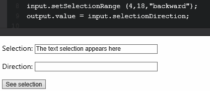
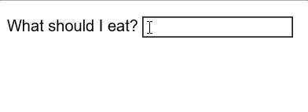
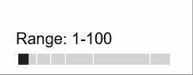
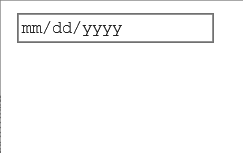
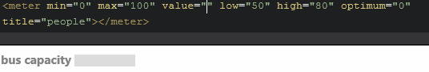
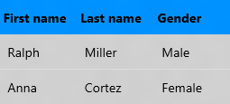

# Newly supported elements and attributes

Microsoft Edge for Windows 10 adds supports for new HTML features per the World Wide Web Consortium (W3C) specifications for [HTML5](http://go.microsoft.com/fwlink/p/?LinkId=203771) and [HTML 5.1](http://go.microsoft.com/fwlink/p/?LinkId=506795).

# Attributes

## a[download] attribute

Microsoft Edge (build 10547+) now supports the [a[download]](../..//apireference/interfaces/htmlanchorelement/) attribute signifying that the resource pointed to in an a-tag link should be downloaded by the browser, and saved as a local file, rather than navigating to it.

```HTML
<a href="/images/example.png" download="image_example">
```

## selectionDirection attribute

The [`selectionDirection`](https://msdn.microsoft.com/library/mt587085) attribute is now supported. With this attribute, you can easily distinguish which direction a selection has been made on a text input whether it be forward, backward, or none.
```javascript
p = object.selectionDirection;
```

This GIF shows a selection being made on some text using `setSelectionRange`, and then `selectionDirection` being used to determine the direction:



## srcset attribute
Edge now supports the [`srcset`](https://msdn.microsoft.com/library/dn955124(v=vs.85).aspx) and [`sizes`](https://msdn.microsoft.com/library/mt599604(v=vs.85).aspx)  attributes, a big step towards providing full support for the picture element, and in turn responsive images.


[`Srcset`](https://msdn.microsoft.com/library/dn955124(v=vs.85).aspx) is an attribute of the [`img`](https://msdn.microsoft.com/library/ms535259(v=vs.85).aspx) element that allows you to declare a set of images and their scale factor (pixel density descriptor) or size (width descriptor). This allows browsers to select the best image for the device currently in use. 
If a browser doesn't understand ``, it will fall back to using the `src` attribute of the image.


The following code snippet shows `srcset` being used to provide three images of increasing widths for the browser.
```
 
```

Resolution can also be a factor as seen below.
```

```

For more information about `srcset`, check out [Introducing srcset, our first step towards fully responsive images in Microsoft Edge](http://go.microsoft.com/fwlink/p/?LinkId=617030) and [Using extended srcset and the picture element to tailor your image to every device and layout](http://go.microsoft.com/fwlink/p/?LinkId=690269) on the Microsoft Edge dev blog.

### img sizes attribute
An attribute of the `img` element, [`sizes`](https://msdn.microsoft.com/library/mt599604(v=vs.85).aspx) allows you to specify how large you would like your image to render. The `sizes` attribute was introduced in [HTML 5.1](https://www.w3.org/TR/html51/).

In this code snippet, `sizes` is used to specify that the viewport must be at least 900px wide and that the image must take up 25% of the viewport. If the viewport has a width greater than 899px, the browser selected image from `srcset` will take up 25% of the viewport. The length `100vw` is the default length.

```

```

## Input types

Enhancing user input capabilities, Microsoft Edge adds support for [`input type=time`](https://msdn.microsoft.com/library/mt584201(v=vs.85).aspx) and [`input type=datetime-local`](https://msdn.microsoft.com/library/mt584200(v=vs.85).aspx) type attributes.  


## input datetime-local attribute
With [`input type=datetime-local`](https://msdn.microsoft.com/library/mt584200(v=vs.85)), you have the combined support of both the time and date inputs, allowing you to select both a date and time in one input. This input type does not support timezone selection.


The following example shows a `datetime-local` input that is set to display the date and time for 12:00:01PM on December 12th, 2015. 

As can be seen here, clicking on the date or time section of the input will make a dropdown selector appear for the specific measurement. The dropdown selector enables quick and easy time selection compaired to having to manually specify a date and time.
```
<input type="datetime-local" value="2015-12-03T12:00:01">
```


## input time attribute
With [`input type=time`](https://msdn.microsoft.com/library/mt584201(v=vs.85).aspx), you are able to easily gather time input. The dropdown that is seen when selecting the time for the `datetime-local` input is the same dropdown for the `time` input. This input type does not support timezone selection.


The following example creates a `time` input that is not set. The user is able to select a time between 9:00AM and 5:00PM.
```
<input type="time" min="09:00" max="17:00">
```

## oninvalid attribute

Microsoft Edge (build 10532+) supports the `oninvalid` attribute and event handler as defined in the [W3C HTML5 API specification](https://www.w3.org/TR/html5/webappapis.html#events). The HTML5 `oninvalid` event attribute executes a specified JavaScript alert when an input element is invalid.

```HTML
<input name="name" type="text" oninvalid="alert('You must enter your name!');" required>
```


## Elements

## datalist element
Support for the [`<datalist>`](https://msdn.microsoft.com/library/hh772925(v=vs.85).aspx) element from the [HTML 5.1 spec](https://www.w3.org/html/wg/drafts/html/master/semantics.html#the-datalist-element) was introduced in Microsoft Edge (build 10240+). `<datalist>` shows a list of pre-defined [`<option>`](https://msdn.microsoft.com/library/ms535877(v=vs.85).aspx) elements to suggest (usually via dropdown menu) as you type in an [`<input>`](https://msdn.microsoft.com/library/ms535260(v=vs.85).aspx) element. While `<datalist>` makes suggestions, it does not lock you into any specific value. You still have the ability to enter whatever you want. To connect the `<datalist>` to an `<input>` element, add the `list` attribute and refer to the `id` attribute, as shown below.

```HTML
<label>What should I eat?
<input type="text" list="snacks" name="mySnack" /></label>
<datalist id="snacks">
  <option value="Orange">
  <option value="Crackers">
  <option value="Celery">
  <option value="Chips">
</datalist>
```



`<datalist>` can be used in a several different `<input>` types, in addition to `text` including:

#### input[type=range] datalist
For the `range` type, `<datalist>` will at ticks to represent the suggested values.

```HTML
<label>Range: 1-100<input type="range" value="0" min="0" max="100" list="number" /></label>
<datalist id="number">
  <option>10</option> 
  <option>20</option> 
  <option>30</option> 
  <option>50</option> 
  <option>90</option> 
</datalist>
```


#### input[type=date] datalist
For the `date` type, `<datalist>` suggests a list of dates, in the `mm/dd/yyyy` format. Labels can also be given to dates in the `<option>` tag.

```HTML
<input type="date" list="days" />
<datalist id="days">
  <option label="New Years Day">2016-01-01</option>
  <option>2016-02-14</option>
  <option label="St Patricks Day">2016-03-17</option>
  <option label="Labor Day">2016-09-05</option>
</datalist>
```


#### input[type=datetime-local] datalist
For the `datetime-local` type, `<datalist>` suggests a list of dates and times, in the `mm/dd/yyyy 12:00 AM` format. Labels can also be assigned in the `<option>` tag.

```HTML
<input type="datetime-local" list="datetime-locals" />
<datalist id="datetime-locals">
  <option label="New Year's Eve">2015-12-31T23:59</option>
  <option>2016-04-04T12:23</option>
  <option>2016-06-22T18:05</option>
</datalist>
```

#### input[type=time] or input[type=month] or [type=week] datalist
The `time` type suggests times in the `11:04 AM` format. The `week` type suggests weeks in the `Week 14, 2016` format. The `month` type suggests months in the `March 1977` format. Labels can be assigned to any of these in the `<option>` tag.

```HTML
<input type="month" list="months" />
<datalist id="months">
  <option>2016-01</option>
  <option label="My Birthday">2016-03</option>
  <option>2016-08</option>
</datalist>
```

> NOTE: As of build 10586, Microsoft Edge does not yet support input[type=color] for the `<datalist>` element. If this is a need, add your request to the Microsoft Edge Developer section of [UserVoice](https://wpdev.uservoice.com/).

## main element
Support for the [`<main>`](https://msdn.microsoft.com/library/mt634542(v=vs.85).aspx) element from the [HTML 5.1 spec](https://www.w3.org/TR/html51/grouping-content.html#the-main-element) was introduced in build 10240+. This is a semantic HTML5 element that represents the main content of the document or application. The `<main>` element is used to indicate what is unique to a document, so repeated content such as navigation links and copyright footers aren't included. This element lets assistive reading technologies know where the main content begins, making it a great tool for increasing accessibility. 


## meter element
Microsoft Edge now provides support for the [`<meter>`](https://msdn.microsoft.com/library/mt573149(v=vs.85).aspx) element, which is detailed in the [HTML5 spec](https://www.w3.org/TR/html51/sec-forms.html#the-meter-element). The `<meter>` element provides you with a way to visually depict a measurement on a known scale. This can be useful for showing capacity. For example, you could use the `<meter>` element to convey that a bus is half full, or that a harddrive is at 100% capacity.

The following example shows a `<meter>` element that displays the capacity of a bus that holds 100 people. As the bus's capacity grows, as signified by the increasing `value`, the meter becomes more full.



By specifying the `optimum` attribute, you're able to make the meter red, yellow, or green depending on how close to `optimum` the `value` is.

The reason for the meter color changes are detailed below:
* A `value` of 25 is between the specified values for `min` and `low`, and is in the closest bracket to `optimum`, making the meter green.
* A `value` of 55 is between the specified values for `low` and `high`, and in a bracket farther away from `optimum`, making the meter yellow.
* A `value` of 95 is between the specified values for `high` and `max`, and is two brackets away from `optimum`, making the meter red.


## picture element

Microsoft Edge now supports the [`<picture>`](https://msdn.microsoft.com/library/mt574001(v=vs.85).aspx) element from the [HTML 5.1 spec](https://www.w3.org/TR/html51/semantics-embedded-content.html#the-picture-element). The `<picture>` element provides you with a simple way to achieve responsive images by allowing you to create adaptive layouts for a variety of devices. The `<picture>` element makes things easy by having you specify multiple [``](https://msdn.microsoft.com/library/ms535259(v=vs.85).aspx) elements of varying resolutions and screen size requirements, and then having your browser make the correct selection. See [`srcset`](https://msdn.microsoft.com/library/dn955124(v=vs.85).aspx) for more info on how a browser selects the proper image to display. For more information about how the picture element works, see [Using extended srcset and the picture element to tailor your image to every device and layout](http://go.microsoft.com/fwlink/p/?LinkId=690269).

Click this picture to see a demo of it being responsive!

[](https://developer.microsoft.com/en-us/microsoft-edge/testdrive/demos/picture/)

For more information about the `picture` element, check out [Using extended srcset and the picture element to tailor your image to every device and layout](https://blogs.windows.com/msedgedev/2015/10/07/using-extended-srcset-and-the-picture-element-to-tailor-your-image-to-every-device-and-layout/) on the Microsoft Edge dev blog.

## template element

Introduced in the [HTML5 spec](https://www.w3.org/TR/html51/semantics-scripting.html#the-template-element), the [`<template>`](https://msdn.microsoft.com/library/mt586693(v=vs.85).aspx) element allows you to easily clone fragments of HTML that can then be inserted into a document by using script. This element is frequently used with Web Components.

The following example produces a 2x3 table of two students' names and genders which is generated using a template.

This code snippet creates the script whose data will be used to populate the table.

```JavaScript
   var data = [
   {
      firstName: 'Ralph',
      lastName: 'Miller',
      gender: 'Male'
   },
   {
      firstName: 'Anna',
      lastName: 'Cortez',
      gender: 'Female'
   }, ];
```

This code snippet creates a table with that utilizes the `<template>` element to add rows that are two cells long.
The `id="row"` property will later be used to find where the template is at using `querySelector`.

```
<!-- make a template for a row of 3 cells -->
   <template id="row">
      <tr>
         <td>
            <td>
               <td>
   </template>
```

A final script tag with a querySelector is used to find where we put our template. 
After the template is found, the table is filled one row at a time using a loop. The line `template.content.cloneNode(true)` is used to clone a new row, and the line `newRow.querySelectorAll('td')` is used to fill the cells for that row.

This example produces the following table after some CSS style has been applied:




To learn more about Web Components and why the `<template>` element is so great, check out [Microsoft Edge and Web Components](https://blogs.windows.com/msedgedev/2015/07/15/microsoft-edge-and-web-components/) on the Microsoft Edge dev blog.

## Related topics

[Introducing srcset, our first step towards fully responsive images in Microsoft Edge](http://go.microsoft.com/fwlink/p/?LinkId=617030)

[Using extended srcset and the picture element to tailor your image to every device and layout](https://blogs.windows.com/msedgedev/2015/10/07/using-extended-srcset-and-the-picture-element-to-tailor-your-image-to-every-device-and-layout/)

[Microsoft Edge and Web Components](https://blogs.windows.com/msedgedev/2015/07/15/microsoft-edge-and-web-components/)
