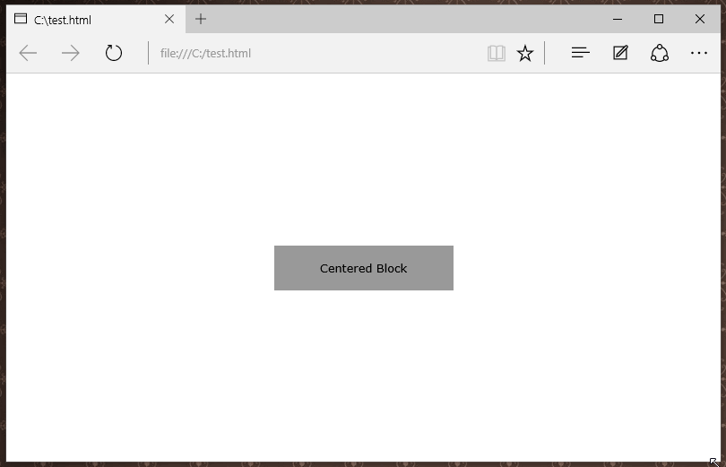

# The calc() function

The `calc()` function can be used wherever length values are allowed -- it's a way to do simple math right in the native CSS. The expression within the parentheses is computed at the same time as 'em' lengths are computed. The `calc()` function supports the following arithmetic operators: 
-  Addition (+)
-  Subtraction (-)
-  Multiplication (*)
-  Division (/)

Addition and subtraction have the lowest precedence; multiplication and division have the highest precedence. Following is an example of how to use the `calc()` function to calculate length values for the margin property:

```CSS
p {
    margin: calc(1rem - 2px) calc(1rem - 1px);
}
````
In this case, the `calc()` function calculates the top and bottom margins as two pixels less than the font size of the root element, and the left and right margins as one pixel less than the font size of the root element. You may also use parentheses to establish computation order when needed:
```CSS
#border {
	height: calc((25vw - 50px) / 2 + 1em);
}
```
The height above is found by first subtracting 50 pixels from the 25 viewport width prior to being divided by 2 and adding 1em. This also demonstrates that different units can be used for each value in your expression. See the table below for examples.

Example | Operator | Result
:------------ | :------------- | :-------------
50% + 10px | Addition | Sum of 50% and 10px
2.5em - 10px | Subtraction | Difference of 2.5em and 10px
100% * 1 / 4 | Multiplication | Product of taking 1/4th of total (25%)
100vw / 2 | Division | Quotient of 100 viewport width and 2 

> NOTE:  The + and - operators must always be surrounded by whitespace. For example, `calc(100% -25px)` is parsed as a percentage followed by a negative length, an invalid expression, while `calc(100% - 25px)` is a percentage followed by a minus sign and a length. Negative lengths can be used, for example, `calc(25px + -50%)` is treated as a length followed by a plus sign and a negative percentage.

## Using calc() to find the vertical center

To position an element halfway down the height of the viewport of a screen, use 50vh (50% of the viewport height), then subtract the height of the element to vertically center it's position:
 `calc(50vh - 1/2 the height of the element)`. 

```CSS
.block {
	display: block;
	margin-left: auto;
	margin-right: auto; 
	margin-top: calc (50vh - 25px);
	width: 200px;
	height: 50px;
}
```



## Demo

[CSS calc() CodePen Demo: Vertically centering an element on the page](https://codepen.io/MicrosoftEdgeDocumentation/pen/eZOjOV?editors=1100#0)

## Specification

[calc() W3C CSS3 Values and Units](https://www.w3.org/TR/css3-values/#calc-notation)
