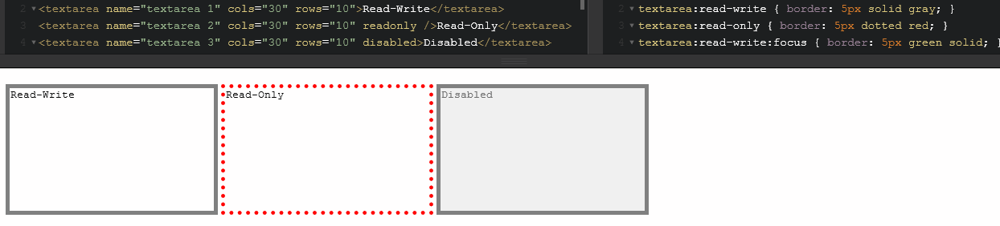
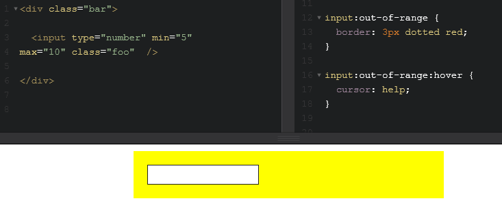

# Newly supported CSS properties and pseudo-classes

Microsoft Edge includes support for the following CSS properties and pseudo-classes.

## Properties

CSS properties are responsible for the look and layout of a page, including font properties, text properties, color and background properties, box properties, and unit properties.

## Font-stretch property

The [`font-stretch`](https://msdn.microsoft.com/library/jj127324(v=vs.85).aspx) property specifies a normal, condensed, or expanded face from a font family.

Property value | Description
:------------ | :-------------
inherit | Indicates that the property takes the same computed value as the property for the element's parent.
wider | Indicates a wider value relative to the width of the parent element.
narrower | Indicates a narrower value relative to the width of the parent element.

The following list of absolute value keywords for the `font-stretch` property are ordered from narrowest to widest.

Property value | Description
:------------ | :-------------
ultra-condensed | Indicates the most condensed font face.
extra-condensed | Indicates the second most condensed font face.
condensed | Indicates a condensed font face.
semi-condensed | Indicates a slightly condensed font face.
normal | Default. Indicates the face is neither condensed nor expanded.
semi-expanded | Indicates a slightly expanded font face.
expanded | Indicates an expanded font face.
extra-expanded | Indicates the second most expanded font face.
ultra-expanded | Indicates the most expanded font face.

The property in itself does not cause the browser to stretch to a font. In order to use `font-stretch` and see a result, the font being used must have a face matching the value specified. `font-stretch` will only work on fonts that are designed with different faces matching the defined sizes.

### Specification
[Font width: the font-stretch property](https://drafts.csswg.org/css-fonts/#propdef-font-stretch)

## Subpixel font scaling

Microsoft Edge build 10240+ supports `subpixel-font-scaling` allowing sub-css-pixel font-sizes for smooth font scaling and a stable layout when zooming. Should improve readability and font rendering quality on high dpi devices. 


## CSS pointer-events property

The [CSS `pointer-events` property](https://msdn.microsoft.com/library/ff972269(v=vs.85).aspx) enables control over how an HTML element responds to mouse/touch events. The `pointer-events` property can prevent click or tap Javascript events from having any effect, can prevent CSS hover/active states from triggering, and can prevent the default cursor pointer from displaying. 

> NOTE: The CSS `pointer-events` property is supported without a prefix in Microsoft Edge build 10240+.

The following are valid `pointer-events` global values for use on any HTMl element:

Property value | Description
:------------ | :-------------
none | Prevents the specified HTML element from being the target of all click, state, cursor or touch options.
auto  | The HTML element behaves as if the pointer-events property were not specified. Useful for restoring the default functionality on child elements of an element with `pointer-events: none;`.
inherit  | The HTML element will use the `pointer-events` value of it's parent element.
initial | Specifies the property's initial value.

A primary use for the CSS `pointer-events` property is to allow click or tap behavior to be prevented on an element, enabling click/tap behavior on another element below it on the Z axis, such as a graphic overlay. 

```CSS
a[href="http://www.bing.com/"] {
  pointer-events: none;
}
```
In the example above, the link to http://www.bing.com/ would not react to click, state, cursor or touch events.

The following `pointer-events` values are only applicable to SVG elements:

Property value | Description
:------------ | :-------------
visiblePainted | Default. The given element can be the target element for pointer events when the visibility property is set to visible and when the pointer is over a painted area. The pointer is over a painted area if it is over the interior (that is, fill) of the element and the fill property has an actual value other than none or it is over the perimeter (that is, stroke) of the element and the stroke property is set to a value other than none.
visibleFill | The given element can be the target element for pointer events when the visibility property is set to visible and when the pointer is over the interior (that is, fill) of the element. The value of the fill property does not affect event processing.
visibleStroke | The given element can be the target element for pointer events when the visibility property is set to visible and when the pointer is over the perimeter (that is, stroke) of the element. The value of the stroke property does not affect event processing.
visible | The given element can be the target element for pointer events when the visibility property is set to visible and the pointer is over either the interior (that is, fill) or the perimeter (that is, stroke) of the element. The values of the fill and stroke do not affect event processing.
painted | The given element can be the target element for pointer events when the pointer is over a painted area. The pointer is over a painted area if it is over the interior (that is, fill) of the element and the fill property has an actual value other than none or it is over the perimeter (that is, stroke) of the element and the stroke property has an actual value other than none. The value of the visibility property does not effect event processing.
fill | The given element can be the target element for pointer events when the pointer is over the interior (that is, fill) of the element. The values of the fill and visibility properties do not affect event processing.
stroke | The given element can be the target element for pointer events when the pointer is over the perimeter (that is, stroke) of the element. The values of the stroke and visibility properties do not affect event processing.
all | The given element can be the target element for pointer events whenever the pointer is over either the interior (that is, fill) or the perimeter (that is, stroke) of the element. The values of the fill, stroke and visibility properties do not affect event processing.

> NOTE: As of Microsoft Edge, this presentation attribute is animatable with CSS Animations and CSS Transitions.

When this property is unspecified, the same characteristics of the visiblePainted value apply to SVG content. In addition to indicating that the element is not the target of mouse events, the value none instructs the mouse event to go "through" the element and target whatever is "underneath" that element instead.

### Specification

[The pointer-events property](http://www.w3.org/TR/SVG11/interact.html#PointerEventsProperty)


## Touch-action property

Supported in Microsoft Edge build 10240+, the [`touch-action`](https://msdn.microsoft.com/library/windows/apps/Hh767313.aspx) property enables web developers to declaratively state how touches should be handled for purposes of scrolling and zooming. If a default touch behavior isn't invoked, DOM events will be fired for that contact instead (see [Pointer](https://msdn.microsoft.com/library/dn433244.aspx) and [gesture](https://msdn.microsoft.com/library/dn433243.aspx) events).

> NOTE: The unprefixed `touch-action` standard is supported in Microsoft Edge build 10240+. Prefixed support, `-ms-touch-action`, should be removed for better standards compliance and future compatibility, but currently remains supported Microsoft Edge build 10240+. 

Property value | Description
:------------ | :-------------
auto | Initial value. Indicates the browser will determine the permitted touch behaviors for the element.
none | The element permits no default touch behaviors.
pan-x | The element permits touch-driven panning on the horizontal axis. The touch pan is performed on the nearest ancestor with horizontally scrollable content.
pan-y | The element permits touch-driven panning on the vertical axis. The touch pan is performed on the nearest ancestor with vertically scrollable content.
pinch-zoom | The element permits pinch-zooming. The pinch-zoom is performed on the nearest ancestor with zoomable content. For more information about specifying content as zoomable, see the -ms-content-zooming property.
manipulation | The element permits touch-driven panning and pinch-zooming. This is the shorthand equivalent of "pan-x pan-y pinch-zoom".
double-tap-zoom | The element permits double-tap-zooming. The double-tap-zoom is performed on the full page. Double-tap-zoom is not available in Windows Store apps using JavaScript.
cross-slide-x | The element permits cross-sliding along the horizontal axis.
cross-slide-y | The element permits cross-sliding along the vertical axis.

### Specification
[ Pointer Events: The touch-action CSS property](http://www.w3.org/TR/pointerevents/#the-touch-action-css-property)

### Related Topics

[Enabling new interoperable panning experiences through the CSS Scrolling Snap Points Specification](https://blogs.msdn.microsoft.com/ie/2013/10/22/enabling-new-interoperable-panning-experiences-through-the-css-scrolling-snap-points-specification/)

### Demos
[Scrolling, panning, and zooming with touch input](http://samples.msdn.microsoft.com/iedevcenter/ZoomAndPan/default.html)

[HTML5 Drag and Drop](http://samples.msdn.microsoft.com/iedevcenter/DragAndDrop/default.html)

## Scrolling Snap Points properties

Microsoft Edge build 10240+ includes prefixed support for CSS Scrolling Snap Points. Scrolling Snap Points give users a fluid and precise scrolling experience for touch and input devices, allowing customizable scrolling experiences like pagination of carousels by setting defined snap points. The Scrolling Snap Points CSS module includes the following prefixed properties and values.

Property value | Description
:------------ | :-------------
-ms-scroll-snap-type | Specifies what type of snap-point should be used for the current element.
-ms-scroll-snap-points-x | Defines where snap-points will be located along the x-axis.
-ms-scroll-snap-points-y | Defines where snap-points will be located along the y-axis.
-ms-scroll-snap-x | Specifies values for the -ms-scroll-snap-type and -ms-scroll-snap-points-x properties.
-ms-scroll-snap-y | Specifies values for the -ms-scroll-snap-type and -ms-scroll-snap-points-y properties.
-ms-scroll-translation | Specifies whether vertical-to-horizontal scroll wheel translation occurs on the specified element.

For more prefixed CSS Scrolling Snap Point properties, see the [Touch: Zooming and Panning](https://msdn.microsoft.com/library/windows/apps/hh453816.aspx) section on touch input and gesture recognition.

### Specification

[CSS Scroll Snap Points Module Level 1](http://www.w3.org/TR/css-snappoints-1/) or ([W3C Editor's Draft](https://drafts.csswg.org/css-snappoints/))

### Related Topics

[Enabling new interoperable panning experiences through the CSS Scrolling Snap Points Specification](https://blogs.msdn.microsoft.com/ie/2013/10/22/enabling-new-interoperable-panning-experiences-through-the-css-scrolling-snap-points-specification/)

# Pseudo-classes

CSS pseudo-classes specify a special state of the element to be selected via a keyword used on the selector.

## Mutability Pseudo-classes

 Microsoft Edge now supports the Mutability pseudo-classes :read-only and :read-write representing whether an elements contents are user-alterable. Their aim is primarily for styling forms based on `disabled`, `readonly` and `contenteditable` HTML attributes.

### :read-write
The :read-write pseudo-class selects an element with content that can be altered by the user. This could be an `input` element, a `textarea`, or a `contenteditable` element.

```HTML
<input type="text" value="Read-write default" />
<p class="test" contenteditable>Type here</p>
```

```CSS
input:read-write {
	border: 5px solid green;
}
```

### :read-only
The :read-only pseudo-class selects an element with content that can not be altered by the user. This could be an `input` element, a `textarea`, or a `contenteditable` element with a setting of `readonly` or `disabled`.


```HTML
<input type="text" value="Read-only" readonly />
```

```CSS
input:read-only {
	border: 5px dotted gray;
}
```

### Combining pseudo-class selectors
Pseudo-class selectors can be used in combination to provide more specific selection options. For example, combining the [`:focus`](https://msdn.microsoft.com/library/cc304080(v=vs.85).aspx) pseudo-class with the `read-write` pseudo-class can apply an additional style when the specified element is both `read-write` and `in-focus`.

```HTML
<textarea name="textarea 1" cols="30" rows="10"></textarea>

<textarea name="textarea 2" cols="30" rows="10" readonly></textarea>

<textarea name="textarea 3" cols="30" rows="10" disabled></textarea>
```

```CSS
textarea:read-write {
	border: 5px solid gray;
}

textarea:read-only {
	border: 5px dotted red;
}

textarea:read-write:focus{
	border: 5px solid green;
}
```

> NOTE: An HTML element with the `diabled` attribute set still inherits the `read-write` default styling, *not* the `read-only` styling. 



### API Reference
[`:read-write`](https://msdn.microsoft.com/library/mt574723(v=vs.85).aspx)

[`:read-only`](https://msdn.microsoft.com/library/mt574722(v=vs.85).aspx)


## Range Pseudo-classes

CSS pseudo-classes specify a special state of the element to be selected via a keyword used on the selector. Microsoft Edge now supports the :in-range and :out-of-range pseudo-classes.

### :in-range
The :in-range pseudo-class selects `<input>` elements with a value within the specified range.

```HTML
<input type="number" min="5" max="10">
```

```CSS
input:in-range {
	border: 3px solid blue;
}
```

This `<input>` will have a 3px blue border style applied unless the value entered is outside of the 5 to 10 range.

### :out-of-range
The :out-of-range pseudo-class selects `<input>` elements with a value outside of the specified range (this can be less than or greater than the maximum and minimum value range).

```HTML
<input type="number" min="5" max="10">
```

```CSS
input:out-of-range {
	border: 3px dotted red;
}
```
This `<input>` will have a 3px dotted red border style applied if a value entered is outside of the 5 to 10 range.

> Note: The range pseudo-class only applies to elements that have a range limitations.

### Combining pseudo-class selectors
Pseudo-class selectors can be used in combination to provide more specific selection options. For example, combining the [`:hover`](https://msdn.microsoft.com/library/cc848866(v=vs.85).aspx) pseudo-class with the `input:out-of-range` pseudo-class can apply an additional style when the specified element is both outside the range and being hovered over with the mouse.

```HTML
<input type="number" min="5" max="10">
```

```CSS
input:out-of-range {
	border: 3px dotted red;
}

input:out-of-range:hover {
	cursor: help;
}
```



### API Reference
[`:in-range`](https://msdn.microsoft.com/library/mt574720(v=vs.85).aspx)

[`:out-of-range`](https://msdn.microsoft.com/library/mt574721(v=vs.85).aspx)


# Keywords: initial and unset

Microsoft Edge now supports the *initial* and *unset* keywords as part of the [CSS Cascading and Inheritance Level 4](http://go.microsoft.com/fwlink/p/?LinkId=626032) specification. These keywords are supported for all properties. 

The *initial* keyword applies the initial value of a property to the specified element. 

``` css
/* Paragraphs are dark grey */ 
p { color: #3C3C3C }

/* Paragraphs in the footer use the initial value of the color property */
#footer p { color: initial }
```

The *unset* keyword erases all values declared earlier in the cascade. If the *unset* keyword is set on a property that inherits from its parent, it behaves like the *inherit* keyword. If it does not inherit from its parent, it behaves like the *initial* keyword. 

``` css
/* Paragraphs are dark grey */ 
p { color: #3C3C3C }

/* Resets the paragraph color to its initial value */
#footer p { color: unset }
```


