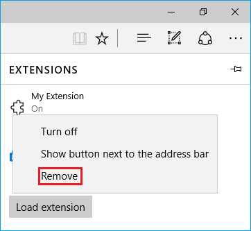

# Adding and removing extensions for preview builds of Microsoft Edge
When fully released to mainstream builds of Windows 10, extensions will be available via the Windows Store. Until that time you can load unpacked extensions downloaded from [https://dev.windows.com](http://www.aka.ms/msedge-extensions). Continue reading for information on how to add and remove your extensions in Microsoft Edge.

## Adding an extension

1. Open Microsoft Edge and download an extension from [https://dev.windows.com](http://www.aka.ms/msedge-extensions)

2. Select **"Run"** from the downloads notification.

     

3. Select **"More (...)"** to open the menu.

     

4. Select **"Extensions"** from the menu.

5. Select the **"Load extension"** button.

6. Choose the extension folder.
> Look for the one starting with **"MSEdge Extensions Preview - ..."** in your **"Downloads"** folder.

7. Select the **"Select folder"** button.

**You're all set! You should now see the extension listed in Microsoft Edge!**

## Moving the extension button
Some extensions (like "Mouse Gestures") add a button to the **"More" (...)** menu

     

If you want to move the button out of this menu for easier access:

1. Right-click the extension button.

2. Select **"Show next to address bar"**.

     

>Remember, you can always move the button back to the **"More" (...)** menu by right-clicking it and unselecting **"Show next to address bar"**.

## Removing an extension

1. Open Microsoft Edge

2. Select **"More (...)"** to open the menu.

3. Select **"Extensions"** from the menu.

4. Right-click the extension you want to remove and select **"Remove"**.

     

**The extension should disappear from the list in Microsoft Edge**

