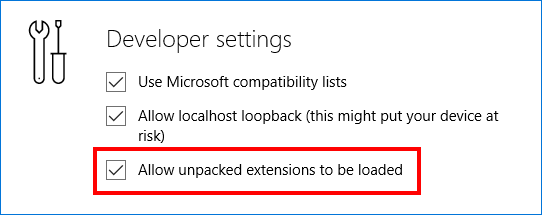

## Troubleshooting

If you are trying to load unpacked extensions downloaded from [https://dev.windows.com](http://www.aka.ms/msedge-extensions) and are experiencing issues,
the following toubleshoot topics may help:

### 1. I see the error "We couldn't load this extension"

This usually means that Microsoft Edge cannot access the extension folder you attempted to load. Try deleting the extension folder, running the .EXE again and then loading the extension folder that was created in your **Downloads** folder.

### 2. I don't see the "Load extension" button
Until extensions are available via the Windows Store, this button *should* be visible by default. If you open the "More" (...) menu, select the "Extensions" menu item and don't see the button, follow these steps:

1. In the address bar type **"about:flags"** and press the **"Enter"** key
2. Under the heading **"Developer settings"** make sure the checkbox next to **"Allow unpacked extensions to be loaded"** is selected.

     

3. Close and re-open Microsoft Edge and check to see if the **"Load extension"** button is now visible.
