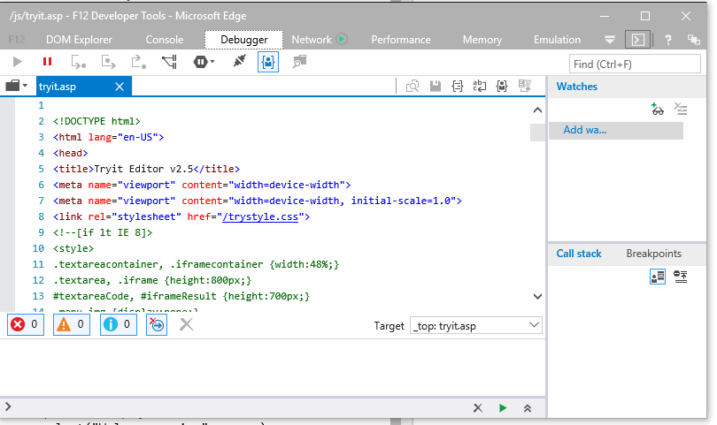
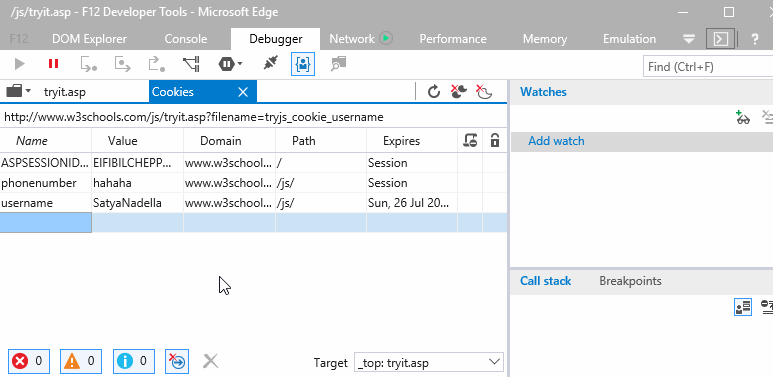
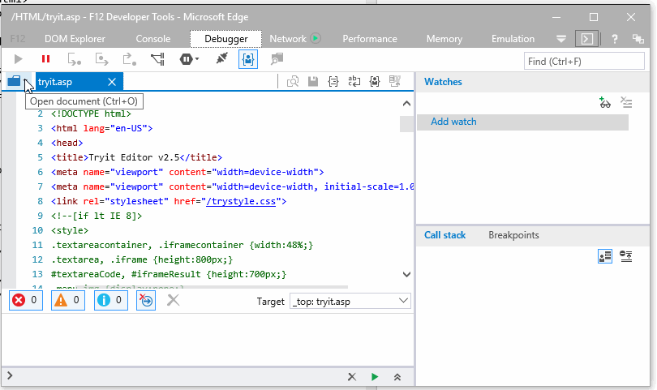

# Viewing and editing web storage in the Debugger

[Some information relates to pre-released product which may be substantially modified before it's commercially released. Microsoft makes no warranties, express or implied, with respect to the information provided here.]

## Cookies
The [**Debugger tool**](./debugger/) provides detailed information about cookies that have been created by an HTTP header or via JavaScript. The cookies folder inside the Debugger's file picker (CTRL + O) displays a list of the frames loaded by the page. Selecting one of these frames opens up a table view of its cookies.  

The cookies view allows you to see and modify existing cookies as well as create new ones. You can also clear individual cookies, session cookies or all cookies using the toolbar or the table's context menu.  

## Session and local storage
Session and local storage contents can also be viewed and edited using the [**Debugger tool**](./debugger/) file picker (CTRL + O). 

Both [session and local storage](https://msdn.microsoft.com/en-us/library/bg142799(v=vs.85).aspx) can store larger amounts of data locally than cookies. Session and local storage never transfer information to the server so there is no affect on performance. Storage persists per domain, so all pages from one domain can store and access the same data using client scripts (think preferences or game scores). 

Session storage makes data available only for the browser session. All data is deleted when the browser window is closed (though data will survive page reloads). Local storage has no expiration date.  

**The data stored in local storage and session storage can be easily read from within the client/browser so should not be relied upon for storage of sensitive or security related data within applications.*
