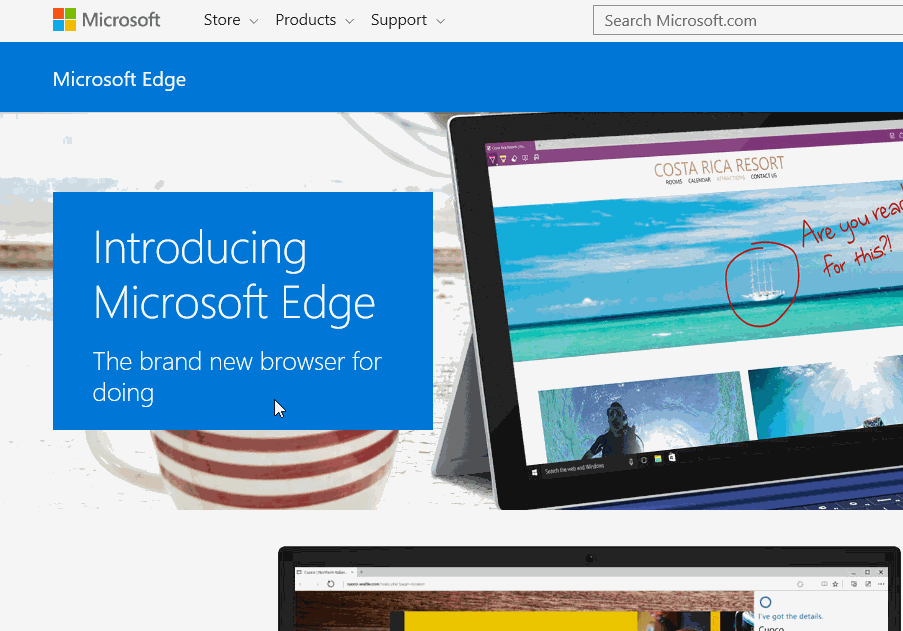
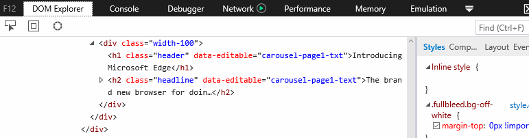
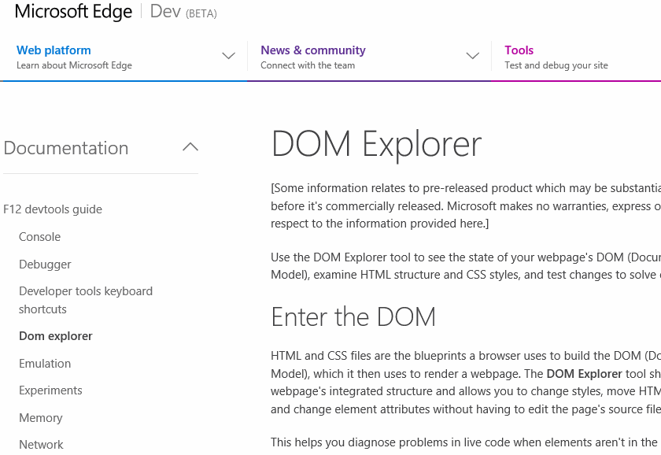
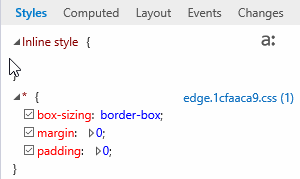
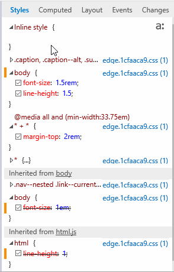
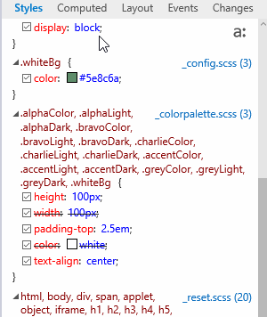
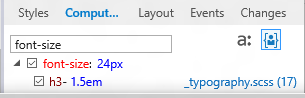

# DOM Explorer

Use the DOM Explorer tool to see the state of your webpage's DOM (Document Object Model), examine HTML structure and CSS styles, and test changes to solve display issues.

## Enter the DOM
HTML and CSS files are the blueprints a browser uses to build the DOM (Document Object Model), which it then uses to render a webpage. The **DOM Explorer** tool shows you a webpage's integrated structure and allows you to change styles, move HTML elements, and change element attributes without having to edit the page's source files.

This helps you diagnose problems in live code when elements aren't in the right place or don't behave as expected, and then work to solve them.

## The elements pane
The elements pane on the left shows the DOM as it's currently constructed. Navigate through it with your mouse, clicking on the arrows next to parent elements to expand them and see their child elements. You can also navigate through it using the arrow keys on your keyboard, using the right and left arrow keys to expand and collapse elements.

### Selecting an element
There are five ways to select an element to inspect:

  - **Inspect element:** Right-click any element in the webpage and select **Inspect element** from the context menu.

  - **From the elements pane:** Use the keyboard or mouse to navigate through the **elements pane**.

  - **Select element:** Click the button next to the **DOM Explorer** title, or press CTRL + B to activate the **Select element** tool. Then click anywhere in the webpage and the element you click is selected.

  - **Breadcrumbs:** After an element has been selected, the bottom of the **elements pane** shows a breadcrumb trail up through its parent elements (if any). Clicking a breadcrumb tile selects the element it represents.

  - **Search:** The "Find" box at the top of the tool searches through the DOM by partial string or CSS selector. Click in the box or type CTRL + F to activate it, type your search string, and press the ENTER key. For searches with multiple results, ENTER will move you forward to the next result. The left and right arrow keys in the search box search backward and forward in the result set. The backward/forward search wraps continuously from beginning to end.

When an element has been inspected, it's highlighted.

The highlight displays not only the element boundaries *(blue)*, but the boundaries of its padding *(pink)*, borders *(green)*, and margin *(yellow)*. It can be toggled on or off using the second button to the right of the **DOM Explorer** tool's title.

### Editing an element
There are three ways to edit an element:

  - **Edit attributes:** You can edit an attribute by double-clicking it, or selecting the element, pressing **Enter**, and then tabbing through the attributes.

   When you edit a class attribute, a list of matching classes from your styles are suggested. Double-click a suggestion or navigate to it with your arrow keys and press **Tab** or **Enter** to select it.

  - **Add an attribute:** Right-click the element and click **Add attribute**.

  - **Edit as HTML:** Right-click the element and click **Edit as HTML**. The element and its child elements appear as plain text inside a bounding box. Edit the text just as you might in a text editor and then click anywhere outside the box to commit your changes.

**Important**  The doctype, html, head, body, and script elements can't be edited as HTML in the DOM Explorer.

If your changes don't produce the desired result, press CTRL + Z to undo the last change. CTRL + Y will redo the change.

### Moving an element
Elements can be moved in two ways:

  - **Drag DOM nodes:** In Microsoft Edge you can drag elements in the elements pane. Click and drag an element to it's new location, just like you would any other type of movable item.

  - **Cut/copy, and paste:** Use right-click context menus or keyboard shortcuts to cut, copy, and paste elements.
   When you copy an element and then paste with CTRL + V, the element on the clipboard is pasted in as a child of the selected   element. Right-click the element to use the **Paste before** option from the context menu.

  **Note**  Don't use the **Copy element with styles** option in the context menu to move an element within the DOM. It places an HTML document containing the element and all its related styles on the clipboard for pasting to an external editor.

### The styles pane
The **styles pane** provides different views for looking at what styles are being applied to the element and what code is being triggered by events associated with it.

The styles pane has five tabs: [Styles](#styles), [Computed](#computed), [Layout](#layout), [Events](#events), and [Changes](#changes), in addition to the [Pseudo State](#pseudo-state) selector and the [Color Picker](#color-picker).

### Styles
The **Styles** tab is a list of all the styles associated with the selected element and which properites are being applied.

Style properties currently applied to the element appear on the top of the style pane, along with a link to the .css file path, line #, and column # where that style is defined. Inherited styles are listed below, identifying which ancestor the inherited styles come from.

You can turn style property on or off by checking or unchecking the box to the left of the property. When unchecked, the style will be crossed out and an inherited style below may become active (removing it's strikeout). The style pane also breaks out which styles are being applied due to [CSS media queries](https://msdn.microsoft.com/en-us/library/bg124120.aspx).

The style pane updates in real time, so if you have media queries based on window width, resizing the window alters the list of applied styles as different media queries are matched.

#### Editing styles

To edit a rule name or property, click it. When typing a property name, matching CSS property names are suggested. When typing a property value, if that property has a defined set of possible values, matching values are suggested. Double-click a suggestion or navigate to it with your arrow keys and press Tab or **Enter** to select it.

To add a new rule or add a property to an existing rule, right-click in the tab and click **Add rule** or Add property.

### Computed
The **Computed** tab traces the source of an element's styling and provides computed values for properties.

This image shows an element's color and the chain of color attributes from parent elements that are being overridden. If a particular property on an element isn't as expected, you can use this visual hierarchy to discover where the property is coming from and what it's overriding.

In the **Computed** tab, properties can be edited or toggled on or off using the check boxes beside them. Turning off the currently active property activates the next property in the chain.

Examples of computed values:

  - **Precise calculations / relative to absolute values:** All properties without hardcoded measures, such as calc() expressions, percentages, em or rem units, are shown with the pixel values calculated for them.

  - **Implied and default values:** The **Computed** styles tab has a **Display user styles only** button .

   When turned on, it shows only user-defined styles. When turned off, it shows the Microsoft Edge default styles and any     implied styles that are being applied to the element. The list can be very long, so a Filter properties box is next to it.  Type text in the box and the properties list will be filtered down to only those that match the text.

#### Change Bars
As you make changes to your properties, **Change Bars** display different colors next to changed (yellow), added (green), and deleted (red) properties.

### Layout
The **Layout** tab shows a box model diagram for the selected element's positioning with colors matching the highlight around a selected element. You can edit any value in the diagram by clicking it.

### Events
The **Events** tab shows the element's DOM events or CSS selectors that have handlers assigned to them in JavaScript. The file names can be clicked to show the file in [the Debugger](../debugger/).

In the image above, one element's click event is being handled by two functions in two scripts. If you were getting unexpected behavior from clicking that element, it could be because one of the handlers should be listening for events on another element.

### Changes
As you experiment with different layout and style changes in the **DOM Explorer**, it's easy to lose track of everything you changed. The **Changes** tab shows a list of all the changes you've made to the DOM structure and CSS styles in your current session with the **DOM Explorer**. Original and current values are shown with different highlight colors.

If you decide you don't like one of the changes, right-click it and select **Revert item** to reverse that change. If you'd like to copy the style to paste into your source files, use **Copy** to copy a single style or **Copy All** to copy all the changed styles in the list.

**Note**  The **Changes** tab will clear if you close the F12 developer tools, but the changes you made with DOM Explorer persist until you refresh the webpage. For example, you can change the width of an element, close the F12 tools, reopen them, and the element remains at its new width while the Changes tab shows no changes.

### Pseudo state

In the upper-right corner of the **Styles** and **Computed** tabs is an icon resembling **a:**. That's called the "pseudo-class toggle." When turned on, check boxes are shown for the common **:hover** and **:visited** pseudo classes. Checking one of those boxes restyles the element as if that pseudo class is active.

If you want to experiment with CSS for a hover effect, turning on pseudo classes and checking Hover makes the element display as if a mouse is hovering over it until the box is cleared or the page is reloaded. This saves you time when fine-tuning a hover effect in **DOM Explorer**.

## Related topics

[The Document Object Model (DOM)](https://msdn.microsoft.com/en-us/library/hh772384.aspx)

[Cascading Style Sheets](https://msdn.microsoft.com/en-us/library/ms531209.aspx)
