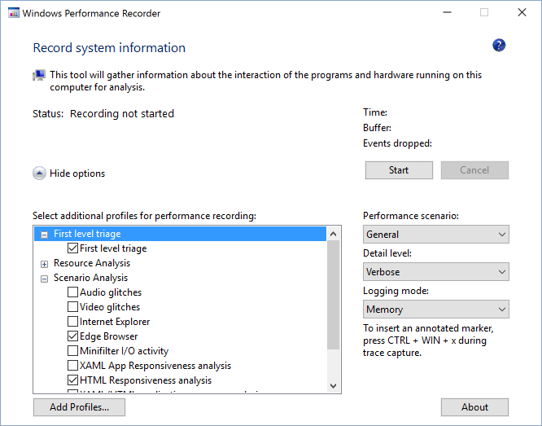
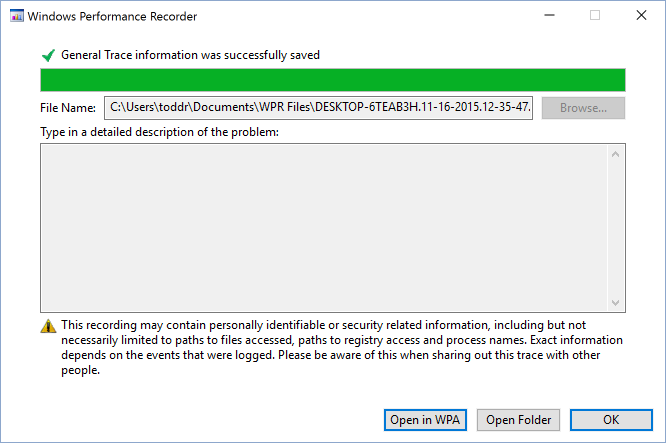

# Recording a trace

Here's how to profile your web scenario with the *Windows Performance Recorder (WPR)*.

## 1. Prepare your environment to gather a performance trace
Shut down as many running programs as possible to avoid noise in the trace that you're about to record. Ideally, the only running software will be Windows Performance Recorder (WPR) and the browser.

## 2. Launch Windows Performance Recorder (WPR) and select options
Launch the Windows Performance Recorder and ensure that **More options** toggle is expanded. Select the *Edge Browser* and *HTML Responsiveness* scenario analysis checkboxes.

#### Tips and tricks for gathering traces
- Try to keep background activity to an absolute required minimum. Background processes may skew both perceived performance and actual performance characteristics and affect the results. Ideally there are no other running applications beside browser and WPR.
- Identify the scenarios you're analyzing and try to keep them as atomic as possible. For example, if your site has performance problems when loading the page, scrolling, and selecting something in a table, separate the issues into three scenarios:
  - Page load (from start of navigation to page load complete)
  - Scroll
  - Selecting something in the table
- If a scenario involves navigating to a site, consider beginning the scenario at about:blank. Starting at about:blank will avoid the overhead of the previous page. If it involves navigating away from a site, navigate to about:blank to complete the scenario. This will keep the noise of other sites out of the trace unless the specific interaction between sites is the issue under investigation.

## 3. Record the scenario
Click **Start** to begin recording. The tool will report the size of the buffer it is using to help you anticipate the size of the generated file. Perform the user scenario you want to measure, then click **Save** to stop the recording and save the trace. Saving immediately after finishing your scenario will help minimize the size of the trace file.

The WPR tool will indicate that your trace information was saved successfully:

## 4. Analyze the trace
Now that you've gathered your performance data, you can [analyze the trace using Windows Performance Analyzer](../1-analyzing-a-trace) to see what optimizations can be made.
