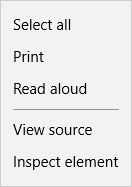

# App context menu

When your PWA runs in the browser, the [contextmenu](https://developer.mozilla.org/en-US/docs/Web/Events/contextmenu) (mouse button right-click) event is handled with browser default behavior. In Microsoft Edge, the default context menu is shown:



For a custom context menu in the browser, you'll either have to roll your own or use a readymade solution, such as a jQuery plugin.

When your PWA runs in a standalone window (*WWAHost.exe* process) as an [installed Windows 10 app](https://docs.microsoft.com/microsoft-edge/progressive-web-apps/microsoft-store), by default no context menu is displayed in response to the *contextmenu* event. However, the WinRT [PopupMenu class](https://docs.microsoft.com/en-us/uwp/api/windows.ui.popups.popupmenu) provides a simple API for building a custom context menu for your PWA when it runs on Windows 10.

## Snippet

Here's an example of how to build a custom context menu with two options and a separator bar using the WinRT [PopupMenu class](https://docs.microsoft.com/en-us/uwp/api/windows.ui.popups.popupmenu). 


The following code would be included in your client-side JavaScript.

```JavaScript
    // Check if WinRT is supported on the device
    if (window.Windows && window.Windows.UI.Popups) {
        document.addEventListener('contextmenu', function (e) {
            var menu = new Windows.UI.Popups.PopupMenu();
            menu.commands.append(new Windows.UI.Popups.UICommand("Option 1", null, 1));
            menu.commands.append(new Windows.UI.Popups.UICommandSeparator);
            menu.commands.append(new Windows.UI.Popups.UICommand("Option 2", null, 2));

            // Convert from page to WinRT coordinates
            function pageToWinRT(pageX, pageY) {
                var zoomFactor = document.documentElement.msContentZoomFactor;
                return {
                    x: (pageX - window.pageXOffset) * zoomFactor,
                    y: (pageY - window.pageYOffset) * zoomFactor
                };
            }

            menu.showAsync(pageToWinRT(e.pageX, e.pageY)).done(function (invokedCommand) {
                if (invokedCommand !== null) {
                    switch (invokedCommand.id) {
                        case 1: 
                            console.log('Option 1 selected');
                            // Invoke code for option 1
                            break;
                        case 2: 
                            console.log('Option 2 selected');
                            // Invoke code for option 2
                            break;
                        default:
                            break;
                    }
                } else {
                    // The command is null if no command was invoked.
                    console.log("Context menu dismissed");
                }
            });
        }, false);
    }
```

## Related topics

[Menus and context menus](https://docs.microsoft.com/en-us/windows/uwp/design/controls-and-patterns/menus)

### API Reference

[PopupMenu](https://docs.microsoft.com/en-us/uwp/api/windows.ui.popups.popupmenu) class

[contextmenu](https://developer.mozilla.org/en-US/docs/Web/Events/contextmenu) event (MDN Web Docs)

[msContentZoomFactor](https://msdn.microsoft.com/en-us/library/hh772066(v=vs.85).aspx) property
