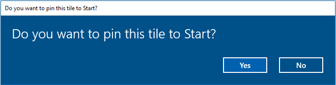

# Start screen tiles

Upon installation, every Windows 10 app gets a *primary tile* (created from the [visual elements](https://docs.microsoft.com/en-us/uwp/schemas/appxpackage/uapmanifestschema/element-uap-visualelements) specified in its `.appxmanifest` file). When you [package your PWA for Windows 10](https://docs.microsoft.com/en-us/microsoft-edge/progressive-web-apps/windows-features#set-up-and-run-your-universal-windows-app), Visual Studio will use the visuals described in your *Web App Manifest* file to generate a *.appxmanfest* and an installable app package.  

Primary tiles are unpinned by default: the user gets to decide whether to pin it to the *Start* menu. It's also possible to pin tiles to the Start menu programmatically, by creating a *secondary tile* and prompting the user with a request to pin it.



If the user accepts, your tile will be pinned to the Start menu.

## Pinning a secondary tile

[Secondary tiles](https://docs.microsoft.com/en-us/windows/uwp/design/shell/tiles-and-notifications/secondary-tiles) are intended for deep linking to specific content within your app, making it easy for users to re-engage with your app in the context most useful to them.

Use the WinRT [`SecondaryTile`](https://docs.microsoft.com/en-us/uwp/api/windows.ui.startscreen.secondarytile.-ctor) constructor to create a new tile and the [`requestCreateAsync`](https://docs.microsoft.com/en-us/uwp/api/windows.ui.startscreen.secondarytile.requestcreateasync#Windows_UI_StartScreen_SecondaryTile_RequestCreateAsync) method to display a prompt asking the user for permission to pin it. 

The following properties are required in order to display the secondary tile:

 - [tileId](https://docs.microsoft.com/en-us/uwp/api/windows.ui.startscreen.secondarytile.tileid#Windows_UI_StartScreen_SecondaryTile_TileId): A unique string used to identify the tile for updating and deletion.
 - [displayName](https://docs.microsoft.com/en-us/uwp/api/windows.ui.startscreen.secondarytile.displayname#Windows_UI_StartScreen_SecondaryTile_DisplayName): The name displayed on the pinned tile and also in the tile's tooltip for the small tile representation in the *Apps* list.
 - [arguments](https://docs.microsoft.com/en-us/uwp/api/windows.ui.startscreen.secondarytile.arguments#Windows_UI_StartScreen_SecondaryTile_Arguments): The string passed to the app through the [launchActivatedEventArgs.arguments](https://docs.microsoft.com/en-us/uwp/api/windows.applicationmodel.activation.launchactivatedeventargs.arguments#Windows_ApplicationModel_Activation_LaunchActivatedEventArgs_Arguments) property to control app behavior when launched from the context of a secondary tile.
 - [secondaryTileVisualElements.square150x150Logo](https://docs.microsoft.com/en-us/uwp/api/windows.ui.startscreen.secondarytilevisualelements.square150x150logo#Windows_UI_StartScreen_SecondaryTileVisualElements_Square150x150Logo): The default pinned tile image, specified as a URI indicating the location of the image within the app package (`ms-appx:///`).

```JavaScript
    // Check if WinRT is supported on the device
    if (window.Windows) {

        // WinRT namespaces
        var SecondaryTile = Windows.UI.StartScreen.SecondaryTile;
        var Uri = Windows.Foundation.Uri;
        var Colors = Windows.UI.Colors;

        // Construct secondary tile and add required properties
        var tile = new SecondaryTile();
        tile.tileId = new Date().getTime();
        tile.displayName = "Secondary app tile";
        tile.arguments = "Args to pass for app activation";
        tile.visualElements.square150x150Logo = new Uri("ms-appx:///images/Square150x150Logo.png");

        // Specify some options
        tile.visualElements.showNameOnSquare150x150Logo = true; // Default is false
        tile.visualElements.backgroundColor = Colors.red; 

        // Ask the user to pin the tile
        var result = tile.requestCreateAsync().done(function () {
            // Handle success and error conditions
        });
    }
```
Check out the [Windows.UI.Colors](https://docs.microsoft.com/en-us/uwp/api/windows.ui.colors) reference for the full list of predefined WinRT colors and how to construct custom hues.

To respond when your user invokes your app from its tile (primary or secondary), listen for the [`WebUI.Activated`](https://docs.microsoft.com/en-us/uwp/api/windows.ui.webui.webuiapplication.activated) event and check if the [`ActivationKind`](https://docs.microsoft.com/en-us/uwp/api/windows.applicationmodel.activation.activationkind) is *launch* and the arguments are the same as the ones you are expecting.

```JavaScript
Windows.UI.WebUI.WebUIApplication.addEventListener("activated", function (activatedEventArgs) {
    if (activatedEventArgs.kind == Windows.ApplicationModel.Activation.ActivationKind.launch &&
        activatedEventArgs.arguments == "secondary tile arguments") {
        // Setup app according to specified context
    }
});
```
You can find more on [pinning secondary tiles](https://docs.microsoft.com/en-us/windows/uwp/design/shell/tiles-and-notifications/secondary-tiles-pinning) in the Windows Dev Center, including how to specify other options, enumerating secondary tiles, and updating and unpinning tiles. The code samples are in C#, but work in JavaScript with the following modifications:

 - Methods and property names use *camelCasing* (the first character of the name should be lowercase).
 - Omit the C# `await` operator for asynchronous function calls. In JavaScript-based Windows 10 apps, [async methods return a promise](https://docs.microsoft.com/en-us/windows/uwp/threading-async/asynchronous-programming-universal-windows-platform-apps#asynchronous-patterns-in-uwp-using-javascript) object that you can use to assign result and error handlers.

Check out the [*Tile notifications and badge updates*](./tasks/tile-notifications.md) sample to learn how to schedule tile updates, set expiration dates for notifications, and add dynamic tile badges to convey app status.

## Related topics

[Tile notifications and badge updates](./tile-notifications.md) sample

[Notifications sample](https://github.com/Microsoft/Windows-universal-samples/tree/master/Samples/Notifications)

[Tiles for UWP apps](https://docs.microsoft.com/en-us/windows/uwp/design/shell/tiles-and-notifications/creating-tiles)

[Secondary tiles](https://docs.microsoft.com/en-us/windows/uwp/design/shell/tiles-and-notifications/secondary-tiles)


### API Reference

[ActivationKind](https://docs.microsoft.com/en-us/uwp/api/windows.applicationmodel.activation.activationkind) enumeration

[SecondaryTile](https://docs.microsoft.com/en-us/uwp/api/windows.ui.startscreen.secondarytile) class

[WebUI.Activated](https://docs.microsoft.com/en-us/uwp/api/windows.ui.webui.webuiapplication.activated) event

[Windows.UI.StartScreen](https://docs.microsoft.com/en-us/uwp/api/windows.ui.startscreen) namespace

